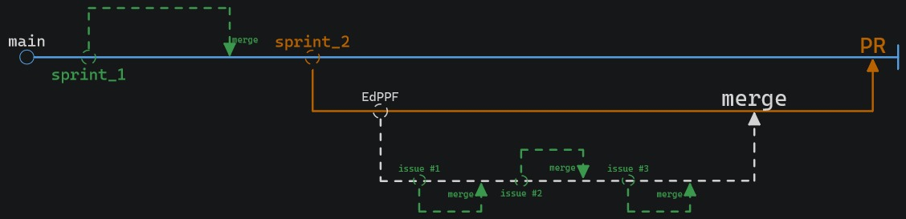

# CAMAAR

**Sistema para avaliação de atividades acadêmicas remotas do CIC**

  

****

- **Versão Ruby**: 3.2.4
- Gems Adicionais:
  - capybara
  - cucumber-rails
  - rspec-rails
  - factory_bot_rails
  - database_cleaner
  - selenium-webdriver
  - devise
  - panko_serializer

## Rodando o Projeto

Para visualizar o app, navege até a raiz do projeto, na pasta `camaar/`, e utilize o comando

```bash
rails db:seed
```

Isso irá popular a base de dados com algumas informações iniciais. Depois, rode o comando

```bash
rails server
```

Para iniciar o servidor. Siga as instruções que aparecerem no terminal ou navege até `localhost:3000/` para abrir a página inicial.

### Testes

Para verificar os testes do Rspec, basta utilizar dentro da raiz do projeto o comando

```bash
rspec
```

## Política de Branching

Cada sprint deste trabalho possui dificuldades e necessidades diferentes.

Para o sprint 1, onde são desenvolvidas as histórias de usuários utilizando o framework Cucumber e BDD, os commits são feitos diretamente na branch do sprint.

Do sprint 2 em diante, onde é feito o desenvolvimento da aplicação em si, será adotado o seguinte modelo de branching:

A partir da branch do sprint, cada membro fará uma branch própria para o desenvolvimento da funcionalidade da qual é responsável. Ao finalizar uma tarefa, deve ser aberto um pull request para a branch do sprint.


